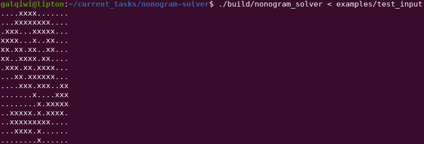

# Nonogram Solver

[What is nonogram](https://en.wikipedia.org/wiki/Nonogram)

## how to build
```
mkdir build && cd build && cmake .. && make
```

## how to run
```
./nonogram_solver < input_examples/test_input
```

